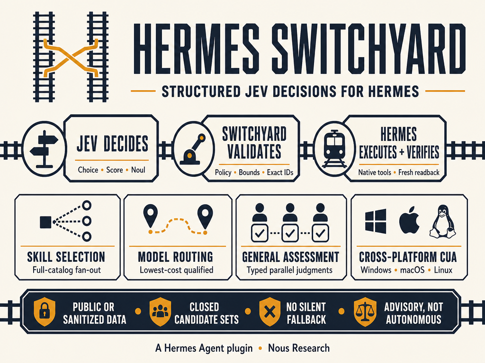

# Hermes Switchyard

Picks the right specialist skill for Hermes more often — cheap, fast, and careful not to invent one when you don’t need it.

Version: 0.5.0

Hermes Switchyard is a plugin that helps Hermes choose skills, models, and computer-use actions. Under the hood it uses [Jev](https://typesafe.ai/blog/introducing-system-one-models-and-jev) for structured decisions; Switchyard applies local policy and keeps actions bounded. Flow: **Jev decides → Switchyard validates → Hermes executes and verifies**. After install, automatic skill routing defaults to **hosted_sanitized** + **load** with standing acknowledgement on: Switchyard can recommend and load one accepted skill per turn when a live Jev key is present. Model routing stays recommend+receipt (`applied: false` until a Hermes apply seam exists). For computer use, receipt-level dual-gate verification sets `goal_verified` only when Hermes agreed `DONE` **and** a local completion condition is satisfied (`verification_owner: hermes_and_url`); a `local_predicate` early-stop may still be `completion_candidate` but keeps both flags false. Switchyard does not modify Hermes core or silently change your active model. Opt down to `local_only` / `advisory` for privacy. Explicit deny/unknown/malformed/restricted host envelopes and restricted local scans still fail closed.



## Why install

Measured feature scorecard for **0.5.0** (selector rows on `c8e6008`; computer-use DOM re-bound to tip-main `a8dae19` after #57+#58). Comparison arms vary by row — not always “product without Switchyard.” Human-readable benefits first; verification hashes live under [Proof](#proof).

| Feature | What this row measures | Comparison arm | Measured arm |
| --- | --- | ---: | ---: |
| Skill pick | Choosing the one right specialist skill for a task | Lexical baseline: 7/12 correct | **`jev_skill_select`:** **12/12** correct |
| Multi-skill pick | Completing a task that needs several skills together | One-skill API (`jev_skill_select`): 0/5 sets complete | **`jev_skill_select_many`:** **5/5** sets complete |
| Model route | Switchyard `jev_model_route`: recommend a model for the task and leave a receipt | No Switchyard recommendation | **Ships in 0.5.0** — 3/3 agree with a local filter + receipt; does **not** switch Hermes’ active model yet (`applied: false`) |
| Assess | Answering a small typed multiple-choice check | First-option baseline: 2/3 correct | **`jev_assess`:** **3/3** correct |
| Automatic skill routing | Quietly suggesting a skill before the model acts (local match) | Off → always silent | 1/2 needed skills caught; no false suggest |
| Computer use | Driving the browser/desktop toward a goal | Stock Hermes `computer_use` A/B still pending fair Session-1 GUI run | **Cat→Felidae DOM** (tip `a8dae19`): 1 click, Jev ~365 ms, ~$0.00021, local `url_contains` satisfied; **`goal_verified: false`** (dual-gate: `local_predicate` early-stop does not self-certify) |

- **Cheap:** about **$0.000055** per skill-select decision (~**$0.055** per 1,000)
- **Fast:** about **0.19 s** typical; **0.30 s** at p95 on the frozen 24-task skill bench
- **Also true, not table rows:** Switchyard does not invent a skill when none fits (0/6 on both arms).
- **Honest gaps:** Automatic routing is not yet a counterbalanced Hermes-session win. Computer-use dual-gate ([PR #57](https://github.com/bgrablin/hermes-switchyard/pull/57) on main) sets `goal_verified: true` only when Hermes `DONE` **and** a local condition match; local-predicate early-stops stay `goal_verified: false`. Stock Hermes GUI A/B is still the open comparison arm.

This shows better single-skill routing and a working multi-skill API. It is not a claim that every Hermes task improves.

<a id="proof"></a>
**Proof:** method, limitations, per-feature tables, and verification hashes → [docs/BENCHMARKS.md](docs/BENCHMARKS.md) · [selector JSON](docs/benchmarks/live-selector-c8e6008.json) · [feature battery JSON](docs/benchmarks/feature-battery-c8e6008.json)

## Install

Ready to try it? One command from the public repo — no GitHub login or token:

```text
hermes plugins install bgrablin/hermes-switchyard --enable
```

The command installs and enables the plugin. To inspect the installed files before enabling it:

```text
hermes plugins install bgrablin/hermes-switchyard --no-enable
hermes plugins list
hermes plugins enable hermes-switchyard
```

The repository command requires no GitHub login or token. Do not put a GitHub token in a clone URL, command, issue report, or repository file. Catalog installation is not available until a human admits the plugin to the Hermes catalog; use the repository command above.

After installing or updating, start a fresh Hermes session so it loads the new plugin. Restart only the Hermes process that needs to load the change.

## Setup requirements

A working Jev call requires one of these profile-scoped secrets:

- `TYPESAFE_API_KEY` for the direct TypeSafe endpoint. This is the preferred low-latency route when available.
- `OPENROUTER_API_KEY` for OpenRouter's Decisions endpoint.
- Enough account credit or allowance for the selected route.

`jev_provider: auto` prefers direct TypeSafe when `TYPESAFE_API_KEY` exists and otherwise uses OpenRouter. Set `jev_provider` to `typesafe` or `openrouter` to pin the route. A ChatGPT or Codex subscription is separate from both accounts and does not pay Jev request charges.

The supported endpoints are `https://api.typesafe.ai/v1/systemone` and `https://openrouter.ai/api/alpha/decisions`. Arbitrary endpoints, redirects, and provider fallbacks are rejected. The client keeps a connection alive across decisions so a multi-step CUA loop does not pay a new TLS setup on every step.

Use the secure setup steps in [docs/SETUP.md](docs/SETUP.md). Never pass an API key with a command-line argument or store it in a URL, repository file, fixture, or issue report.

## Supported features

- **General assessment:** `jev_assess` exposes Choice, Score, and Noul through validated bounded requests. Large independent question sets are batched without dropping questions; the plugin never turns a probability into an unreviewed side effect.
- **Session search re-rank:** `jev_session_search_rerank` re-ranks a stock Hermes `session_search` FTS shortlist with a Jev Choice (optional message-id Choice). Cards are redacted and capped; full transcripts stay local. Fail-open returns the first FTS hit when Jev is down or low-confidence. See `docs/SESSION-SEARCH-RERANK.md`.
- **Skill selection:** `jev_skill_select` recommends one skill from the candidate list supplied by Hermes. Catalogs larger than Jev's per-Choice limit are searched with partition fan-out and recursive reduction; no tail is silently discarded. It never loads the skill.
- **Multi-skill selection:** `jev_skill_select_many` independently scores the complete bounded catalog and returns a typed list of exact skill identifiers. It is a separate advisory contract and never loads or mutates skills.
- **Adaptive reasoning effort (default on):** On Hermes ≥ 0.21, Jev picks `reasoning_effort` (`none`/`minimal`/`low`/`medium`/`high`/`xhigh`/`max`/`ultra`) per turn and after tools through `llm_request` middleware — raise when stuck, lower for routine work. Fail closed keeps the previous effort. Disable with `hermes config set plugins.entries.hermes-switchyard.settings.adaptive_reasoning_effort false`. `jev_model_route` stays advisory (`applied: false`); this is the apply-able win.
- **Model routing:** `jev_model_route` is **recommend + receipt (advisory)**. It filters candidates using explicit code-owned metadata and requirements, then recommends the lowest-cost qualified candidate and leaves an auditable receipt. It does **not** auto-apply or change Hermes' active model (`applied: false` until a Hermes apply seam exists). `route_model_from_registry` and `hermes_switchyard.model_route_adapter.recommend_model_route` supply a first-class approved-registry path with the same receipt contract. `jev_model_route_approved` instead reads a profile-owned approved registry with policy validated locally, including operator-managed version and expiry fields. Neither tool changes the active Hermes model or tries another provider when Jev fails. Stale registry generations abstain as `stale_registry`; an empty registry abstains as `empty_registry`.
- **Cua Driver computer use:** `jev_computer_use` is registered by default in the `computer_use` toolset on **Windows, macOS, and Linux** (cross-platform). Public web goals (`start_url` or an https URL in the goal) run a DOM browser loop: one Jev request per step, page clicks, no Hermes `computer_use` between actions. Desktop apps without a URL still use Cua Driver. Standing `public_or_sanitized_data_ack` is on after install, so callers may omit it. A live Jev route is still required. A session only exposes the tool when the `computer_use` toolset is selected; see [Toolsets and session exposure](#toolsets-and-session-exposure). The DOM backend runs a fresh headless profile, reports its `backend`, `session_mode`, `browser`, and confinement class, offers scroll-relative targets with stable identities, and evaluates an optional caller-supplied `completion_condition` locally so it can stop without another request. Receipt-level dual-gate verification sets **`goal_verified: true`** / `verified: true` only when Hermes agreed `DONE` (`completion_source: provider_decision`) **and** a local completion condition is satisfied (`verification_owner: hermes_and_url`); a `local_predicate` early-stop may still be `completion_candidate` but keeps both flags false. It can type into ordinary text fields when `text_inputs` are supplied; it does not upload, authenticate, or attach to an existing browser session. Those goals, and typing goals without values, return `unsupported_capability` before any request. See [docs/DOM-BROWSER-BACKEND.md](docs/DOM-BROWSER-BACKEND.md).

## Automatic skill recommendations

When the plugin is enabled, the `pre_llm_call` lifecycle hook is on by default. It discovers the **full** active profile skill registry through Hermes' supported `skills_list` API, performs a fast local match, and (with the install defaults) may call hosted Jev when a provider key is available. Install defaults are `automatic_skill_routing_mode: hosted_sanitized`, `automatic_skill_consumer_mode: load`, and `automatic_skill_public_or_sanitized_data_ack: true`. Advisory mode cannot authorize hosted work (`consumer_contract_unmet`). Set `automatic_skill_jev_mode` to `uncertain_only` only when latency matters more than Jev coverage.

Happy path after install: save one key via `hermes switchyard setup`, start a fresh session. No config-set commands are required to turn automatic features on.

### Opt down for privacy

```text
hermes config set plugins.entries.hermes-switchyard.settings.automatic_skill_routing_mode local_only
hermes config set plugins.entries.hermes-switchyard.settings.automatic_skill_consumer_mode advisory
hermes config set plugins.entries.hermes-switchyard.settings.automatic_skill_public_or_sanitized_data_ack false
```

The local scan rejects high-confidence secrets and payment or verification values before the hosted client is constructed. Topic words such as "private" or "verification" do not skip Jev. Hosted construction requires `load` consumer mode and standing acknowledgement. When the host forwards a `turn_egress_policy` allow envelope (`version: 1`, `decision: "allow"`, `data_class: "public"` or `"sanitized"`, bounded `allowed_payload`), that envelope authorizes the turn (`egress_authority: host_envelope`). When no envelope is present and the local scan is clean, standing acknowledgement authorizes the turn (`egress_authority: standing_ack`) using the bounded task text that passed the scan. Explicit denied, unknown, restricted, or malformed envelopes fail closed. Restricted local scans fail closed. Hosted automatic routing is never constructed while the routing mode remains `local_only`, regardless of the acknowledgement setting.

Automatic hosted Jev receives only the authorized bounded payload and exact candidate identifiers. Candidate descriptions, conversation history, and full skill bodies remain local. A valid Jev abstention is preserved; a transport failure may preserve a local winner. The hook exposes only redacted routing status/reason metadata.

With `automatic_skill_consumer_mode: load` (install default), Switchyard passes one accepted exact identifier to Hermes' normal `skill_view` loader once per turn. Set it to `advisory` to add model-visible context without loading anything (and without authorizing hosted construction). Explicit skill instructions, abstention, invalid results, conflicts with configured mandatory skills, and loader errors do not trigger an automatic load. Typed callback metadata and the local receipt report the selected identifier, source, consumer status, and whether the load occurred.

Inspect the active profile's redacted routing mode and provider readiness without displaying a credential:

```text
hermes switchyard status --json
```

## Privacy and data handling

Jev tools treat `public_or_sanitized_data_ack` as on after install. Callers may omit it. Pass `false` or set `plugins.entries.hermes-switchyard.settings.public_or_sanitized_data_ack` to false to refuse. Hermes owns data classification; this flag is not a scanner. Automatic skill recommendations still use their own persistent setting plus a local per-turn scan.

For Cua Driver computer use, Jev may receive the goal, target application, window title, safe control labels, visible context, and recent actions through the selected Jev endpoint. Text-field operations use only bounded caller-supplied values from `text_inputs`; the registered tool never calls a conversational Hermes LLM between Jev actions and abstains when no caller value is supplied. Do not send private, employer, regulated, credential, password, API-key, token, payment, or verification-code data.

## Evidence, reconciliation, and deadlines

`jev_computer_use` returns one typed receipt that records what is known, not a single success boolean. A dispatched action records the native `verdict`, whether the executor `effect_confirmed` the change, the `effect_status` string, and any `escalation`. These are distinct evidence levels: a native verdict is not proof a downstream task finished, load-mode verification is not proof a recommendation was correct, and an observed postcondition is not proof the whole goal was satisfied. Receipt-level dual-gate verification sets `goal_verified` / `verified` true only when Hermes agreed `DONE` (`completion_source: provider_decision`) and a local completion condition is satisfied; `verification_owner` is then `hermes_and_url`. A `local_predicate` early-stop (caller-supplied or derived) may still be `completion_candidate` but keeps both flags false. Provider `DONE` without a satisfied condition stays unverified (`verification_owner: coordinator`).

Expected exceptions preserve partial progress instead of discarding it. If a later action, fresh capture, or native dispatch fails, the receipt still lists every prior action, decision, provider request, and cost, and it sets `reconcile_before_retry: true` when any side effect may already exist. That flag asks the coordinator to inspect before replaying; it is not a claim that replaying is safe.

Provider usage after a partial failure can be incomplete. A missing usage value is not zero usage. A receipt may report a partial subtotal from completed responses and mark the operation cost incomplete rather than claiming a finished total.

Operation deadlines are cooperative, not hard. The loop checks `operation_remaining_deadline()` before each Jev request and native action and bounds each request by the time left. Native operations such as a blocking dispatcher call or a lock acquisition may not be interruptible mid-flight, so the plugin does not claim to force a desktop action to stop instantly and never retries silently after the caller believes the operation stopped.

## Tools and limits

The tools are advisory and bounded:

- A high confidence score is not proof that a choice is correct.
- Switchyard can return no selection when eligibility or confidence checks fail. This valid result is called abstention.
- The default `load` consumer invokes Hermes' normal loader once for an accepted turn. Set `advisory` to recommend without loading; neither skill mode changes runtime models. Model routing stays recommend+receipt (`applied: false`). Computer use sets in-tool `goal_verified` only under dual-gate (Hermes `DONE` + local condition); that is not a claim that every GUI task is certified.
- Provider fallback is disabled. A failed Jev request does not silently move to another provider.
- Each assessment, skill-selection, or model-routing operation has one aggregate 64-request budget. A CUA run has one aggregate 256-request budget across its 100-action ceiling; serialized request size is also bounded.
- Skill selection and model routing work wherever Hermes can expose the plugin toolset. `jev_computer_use` is available on Windows, macOS, and Linux when Hermes' Cua Driver-backed `computer_use` tool is available.
- The repository's offline tests use synthetic transports and do not call OpenRouter or drive a real GUI.

Future work includes reviewed catalog admission, independent real-GUI coverage, multi-skill *planning/coordination* beyond `jev_skill_select_many`, and a counterbalanced whole-agent benchmark. Those are not provided by this release.

## Safe credential setup

The plugin can use either `TYPESAFE_API_KEY` or `OPENROUTER_API_KEY`. Both are optional alternatives, so plugin installation does not prompt for either one. Hermes prints `after-install.md` at the end of install; `hermes switchyard guide` reprints those next steps. After installation, save one key through Switchyard's masked setup command. With `jev_provider: auto`, direct TypeSafe is preferred when both are present.

```text
hermes plugins install bgrablin/hermes-switchyard --enable
hermes switchyard setup --provider typesafe
hermes config set plugins.entries.hermes-switchyard.settings.jev_provider auto
```

Do not use `hermes auth add openrouter` for this plugin. Switchyard reads profile-scoped secrets through Hermes' secret scope. Check readiness without displaying a key:

```text
hermes plugins list --enabled
hermes plugins doctor /path/to/hermes-switchyard --ci
```

## Cua Driver prerequisites

`jev_computer_use` reuses Hermes' existing Cua Driver-backed `computer_use` tool. Install and diagnose that toolset through Hermes, not by vendoring a second driver into Switchyard:

```text
hermes computer-use install
hermes computer-use doctor
hermes -t computer_use chat
```

Cua Driver supports background desktop actions on Windows, macOS, and Linux. Switchyard adds the Jev decision layer, application-owned candidate IDs, partitioned target choices, fresh identity checks, and independent-completion semantics. It does not bypass Hermes approval or Cua Driver safety controls.

## Toolsets and session exposure

Hermes puts a tool in a session's callable catalog only when the toolset the tool is registered under is selected for that session. Switchyard registers its five tools under two toolsets:

| Toolset | Tools | Notes |
| --- | --- | --- |
| `computer_use` | `jev_computer_use` | Hermes' own low-level `computer_use` tool is in the same toolset. |
| `hermes_switchyard` | `jev_assess`, `jev_skill_select`, `jev_skill_select_many`, `jev_model_route`, `jev_session_search_rerank` | The plugin's own toolset; nothing else is registered in it. |

Selecting one of the two toolsets does not select the other, and Switchyard adds no tool to any other core toolset.

- **No pin.** A session started without `--toolsets` uses Hermes' default selection for the CLI. With Hermes' default configuration that selection includes both toolsets. A toolset list saved by `hermes tools` that leaves Computer Use off keeps `jev_computer_use` out of sessions while the four decision tools stay callable. Enable Computer Use in `hermes tools`, or pin the toolset for the session.
- **Explicit pin.** `--toolsets` (`-t`) replaces the default selection and does not add plugin toolsets. `hermes -t computer_use chat` exposes `jev_computer_use` and no decision tool. `hermes -t hermes_switchyard chat` exposes the four decision tools and no computer-use tool. A pin such as `terminal`, or the `hermes-cli` composite alone, exposes none of the five tools even though all five stay registered. To expose all five, name both toolsets. In PowerShell, quote the list, because an unquoted comma is PowerShell's array operator. Hermes also subtracts the configured `agent.disabled_toolsets` list from every CLI session, including one with an explicit pin, so a toolset named there stays unreachable whatever `--toolsets` says. Remove the name from that list in `config.yaml`, or enable the toolset in `hermes tools`, which also removes it from the list for the CLI.
- **Outside the selection means unreachable.** Hermes' Tool Search bridge (`tool_search`, `tool_describe`, `tool_call`) is scoped to the same selection, so `tool_describe` reports a tool outside it as not found. That is a toolset-selection or registration problem, not a Jev outage.

```text
hermes -t computer_use,hermes_switchyard chat
```

**Registered** and **callable** are different facts. Registered means Hermes' registry holds this plugin's own registration for the tool. Callable means the tool is in the catalog Hermes builds for a session with a given toolset selection. `hermes switchyard status --json` reports both for each tool, so an operator can tell which one failed. With no `--toolsets` it evaluates the selection Hermes' CLI would use for a new session; with `--toolsets` it evaluates that pin, as `hermes chat --toolsets` would:

```text
hermes switchyard status --json
hermes switchyard status --json --toolsets computer_use,terminal
```

`status` never reports `ready` while a registered tool is missing from the evaluated catalog. Its values are `ready`, `credential_required`, `tools_not_registered`, `tools_not_callable`, and `exposure_unverified`. `ready` and `credential_required` follow the key of the provider the configured route uses, reported as `effective_provider`; a key for the other provider does not count. [docs/SETUP.md](docs/SETUP.md#confirm-what-a-session-exposes) explains each field and reason. `status` evaluates a fresh session. It does not read the catalog of a session that is already running, so start a fresh session after changing the plugin, its configuration, or the toolsets.

## Configuration

Settings are profile-scoped under `plugins.entries.hermes-switchyard.settings`:

```text
hermes config set plugins.entries.hermes-switchyard.settings.jev_provider auto
hermes config set plugins.entries.hermes-switchyard.settings.computer_max_steps 100
```

`jev_provider` is `auto`, `typesafe`, or `openrouter`. `api_endpoint` may only be the fixed direct TypeSafe or OpenRouter endpoint. Leave `jev_model` empty to select the provider default. Each Hermes profile has its own settings and secret scope.

## Missing-key symptoms

When neither `TYPESAFE_API_KEY` nor `OPENROUTER_API_KEY` is available, Hermes can disable the plugin during loading. If a handler is reached without a key, the plugin fails closed with a generic request-validation error; it does not print credentials or provider response text.

The supported recovery is:

1. Run `hermes switchyard setup --provider typesafe` or use `--provider openrouter` and enter the key only in the masked prompt.
2. Start a fresh Hermes session.
3. Run `hermes plugins list --enabled`.
4. From the plugin root, run the native check:

```text
hermes plugins doctor . --ci
```

Plugin Doctor checks whether Hermes can import and register the plugin. It does not test a live Jev request or prove that a GUI task succeeded. It runs plugin code in-process, not in a sandbox, so use it only with trusted code.

## Updating and rollback

For an unpinned repository install:

```text
hermes plugins update hermes-switchyard
```

An exact-SHA install does not move implicitly. Remove the installed copy, reinstall the reviewed commit with `--ref` as described in [docs/RELEASE.md](docs/RELEASE.md), then enable the plugin if required. Check the result with `hermes plugins list` and `hermes plugins doctor . --ci` before enabling it.

These operations replace only the plugin under the active profile's plugin directory. They do not patch Hermes core. Keep the previous reviewed SHA as the rollback target.

## Offline verification

The repository has no runtime Python dependency beyond Hermes for native loading and requires Python 3.11 or newer for offline checks:

```text
python -m unittest discover -s tests -v
python evaluation/evaluate.py --validate
python scripts/check_portability.py
```

Release archives use an exact Git source commit, include `SOURCE-MANIFEST.json` and embedded `SHA256SUMS`, and are extracted and verified before the builder returns. Release and candidate review instructions are in [docs/RELEASE.md](docs/RELEASE.md).

## Documentation

- [Setup](docs/SETUP.md)
- [Release instructions](docs/RELEASE.md)
- [Feature and test matrix](docs/TEST-MATRIX.md)
- [Benchmark methods and live results](docs/BENCHMARKS.md)
- [Approved model-routing policy](docs/MODEL-ROUTING.md)
- [Contributing](CONTRIBUTING.md)
- [Security reporting](SECURITY.md)
- [Third-party references](THIRD_PARTY.md)
- [Changelog](CHANGELOG.md)
- [Brand assets](docs/assets/hermes-switchyard-branding.png)

Own work is MIT-licensed. See `THIRD_PARTY.md` for conceptual upstream references.