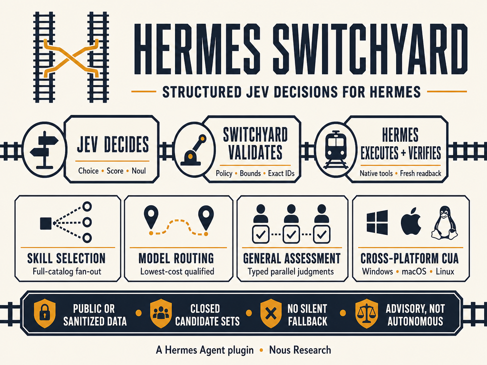
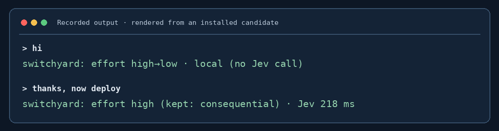

# Hermes Switchyard

Version: 0.5.6

Switchyard is a [Hermes Agent](https://github.com/NousResearch/hermes-agent) plugin for bounded [Jev](https://typesafe.ai/blog/introducing-system-one-models-and-jev) decisions. It can choose and load a matching skill for one turn, lower reasoning effort within your selected cap, and guide a public DOM browser or desktop task. Local receipts show what the plugin selected, skipped, or could not verify. Model routing remains advice: it does not switch your model.



The [Switchyard branding image](docs/assets/hermes-switchyard-branding.png) is also packaged.

**Release state:** version 0.5.6. It includes local decisions for trivial turns, visible effort receipts, a session summary, and a 0.4 s default decision deadline. Research Navigator (F1) and DOM Progress & Recovery (F2) are **not included**: both failed their frozen release evaluations on closed [PR #132](https://github.com/bgrablin/hermes-switchyard/pull/132) and [PR #135](https://github.com/bgrablin/hermes-switchyard/pull/135). [Issue #139](https://github.com/bgrablin/hermes-switchyard/issues/139) tracks follow-up work. Do not install those PRs as if they were shipped features. The [changelog](CHANGELOG.md) separates included work from the two evaluations. The [benchmark report](docs/BENCHMARKS.md) names the older source and limits of its measurements; it does not prove that Jev improves every task.

## First-run quickstart

You need a working Hermes installation, one TypeSafe or OpenRouter account key, and approval to send **public or sanitized** task data to that provider. Jev requests can incur charges beyond a ChatGPT or Codex subscription. The commands below use the active Hermes profile.

1. Install the public Git repository. Hermes scans the source before it installs anything:

   ```text
   hermes plugins install bgrablin/hermes-switchyard --no-enable
   ```

2. Enable the plugin without granting built-in tool overrides:

   ```text
   hermes plugins enable hermes-switchyard --no-allow-tool-override
   ```

3. Save one provider key in the masked prompt. Do not put it in a command, chat, URL, or repository:

   ```text
   hermes switchyard setup --provider typesafe
   # or: hermes switchyard setup --provider openrouter
   ```

4. Start a fresh Hermes session. Read the local status and registration result:

   ```text
   hermes switchyard status --json
   hermes plugins doctor hermes-switchyard --ci
   ```

5. If you accept a billed **public synthetic** test, make one explicit decision request:

   ```text
   hermes switchyard test --live --public-or-sanitized-data-ack
   ```

The live test is optional. A status of `ready` checks key presence and tool exposure; it is not a successful Jev decision. The live test reports `passed` only after a provider response. Plugin Doctor checks registration, not account readiness or model quality. The installer can block a community Git source after a security scan. Read the findings before you approve any override; do not treat a blocked install as success. A fresh session or gateway restart is necessary before an already-running session uses a new plugin.

**First-run evidence:** the [public-SHA first-run check](docs/FIRST-RUN.md) measured a clean install, enable, local status, Doctor, and an installed-plugin no-network decision. Those local steps took 8.940 s. Key entry, a fresh interactive session, and a provider response were not measured. The complete under-two-minute first run is **not verified**.

## What you will see

Automatic skill routing uses `hosted_sanitized` and `load` by default. On an eligible turn, it can send a bounded task and candidate names to Jev, then load one accepted skill. Adaptive effort keeps your `/reasoning` level as the cap. A greeting or thanks can go to `low` locally, with **no Jev call**. A consequential request such as `thanks, now deploy` did call Jev in the installed-candidate trace. The trace recorded these visible lines:

```text
Reasoning: high→low · local decision
Reasoning: kept at high — consequential request · 218 ms
```

The first line followed `hi`; the second followed `thanks, now deploy`. These are recorded receipt lines, not a latency promise. The image is a rendering of recorded output, not a live terminal capture:



The Hermes status bar keeps showing your `/reasoning` level. That level is Switchyard's cap. The receipt line shows the level each turn actually sent.

Run `/switchyard effort status` for the last decision or `/switchyard effort summary` for recent choices and local/Jev counts. Use `hermes switchyard receipt --json` for stored skill-routing receipts. A receipt reports a decision, not answer correctness or browser-goal completion. See [automatic routing](docs/AUTOMATIC-INTEGRATION.md) and [adaptive effort](docs/ADAPTIVE-REASONING-EFFORT.md).

## Privacy and egress

The two default-on automatic paths have different data rules:

- **Adaptive effort:** the current branch uses Hermes `agent.redact.redact_for_egress` through `redact_for_jev` on the whole current message before it sends a bounded 1,200-character excerpt. It also sends closed-set stage and tool-status metadata. It does not send earlier messages, memory, tool output, or private files. Without the Hermes redactor, a nontrivial eligible turn can use a **metadata-only Jev decision**: closed-set size buckets and flags, turn index, and tool statuses, but no message text. A trivial turn can decide locally with no Jev call. If the input is restricted or the acknowledgement is off, it keeps your effort without a hosted call. Explicit proprietary and confidential markings stay local. A clean scan does not prove that other private text is safe to send.
- **Skill routing:** the current branch scans the whole task locally for restricted markings, injection shapes, control characters, and structured payloads. It then passes clean text through Hermes `redact_for_egress` plus bounded masks before sending up to 4,000 characters and exact candidate names. Without the Hermes redactor, it skips hosted routing and uses local matching. Ordinary words such as `password` and `confidential`, email addresses, and phone numbers are not restricted shapes. They do not authorize private content. Bounded descriptions or skill excerpts require a separate opt-in.
- **Explicit tools and DOM browser:** only submit public or deliberately sanitized inputs. The browser cannot log in to your existing session or upload a private file. A public URL alone will not make a private goal safe.

TypeSafe and OpenRouter are external providers. Automatic requests do not read raw tool output or files; recognized secret values are scrubbed before the bounded text excerpt. A new secret shape in the current message can still escape a pattern-based scrubber. Do not submit secrets or private content; explicit tools send caller-supplied inputs under their own policy. The acknowledgement flags are not data loss prevention. Switchyard does not authorize private, employer, regulated, credential, payment, or verification content for hosted decisions. To stop automatic hosted skill routing, use `local_only`. To stop adaptive message-text egress, set adaptive effort to `false`:

```text
hermes config set plugins.entries.hermes-switchyard.settings.automatic_skill_routing_mode local_only
hermes config set plugins.entries.hermes-switchyard.settings.adaptive_reasoning_effort false
```

You can also set `public_or_sanitized_data_ack` and `automatic_skill_public_or_sanitized_data_ack` to `false` independently. Start a fresh session after a setting change. Read [setup](docs/SETUP.md) and [automatic routing](docs/AUTOMATIC-INTEGRATION.md) for the full boundary.

## Supported features

| Surface | Available now | Default |
| --- | --- | --- |
| Tools (7) | `jev_assess`, `jev_skill_select`, `jev_skill_select_many`, `jev_model_route`, `jev_model_route_approved`, `jev_session_search_rerank`, `jev_computer_use` | Callable when the corresponding toolset is selected |
| Hooks (5) | `pre_llm_call` for automatic skill routing and effort capture; `post_llm_call` to clear that capture; `post_tool_call` for reconsideration; `transform_llm_output` for the visible effort line; `post_api_request` for usage counts | On after install |
| Middleware (1) | `llm_request` for request-scoped reasoning effort | On when supported by Hermes |
| Local report (0.6.0 candidate; not in 0.5.6) | `hermes switchyard wow` and `/switchyard wow` summarize retained observations without a provider call; [limits and JSON schema](docs/WOW-LOCAL-REPORT.md) | Trailing 7 days; read-only |
| CLI (offline) | `hermes switchyard lint-skills [--json]` checks description routability; see [limits](docs/LINT-SKILLS.md) | Explicit only; no provider calls or edits |

Doctor reports six hook registrations because two handlers use `pre_llm_call`; the manifest lists five distinct kinds. `jev_skill_select_many` recommends several skills but does not load them. The automatic hook can load one accepted skill per identified turn. The model-routing tools do not apply a model switch. Jev `DONE` alone does not verify a browser goal; Switchyard also needs its local completion condition. An early local stop is a candidate, not verified success. [Browser receipts](docs/DOM-BROWSER-BACKEND.md) show the separate action, effect, and goal fields.

## Automatic skill recommendations

Switchyard reads the active profile's skills at the beginning of an eligible turn. Its default hosted path uses one or more bounded Jev requests, then can load one accepted skill. Explicit skill instructions take precedence. Invalid results, policy refusal, missing candidates, or a loader error can leave the turn without a loaded skill. The local matcher can also abstain. Set `automatic_skill_routing_mode=local_only` to keep this plugin's automatic skill selection local, and `automatic_skill_consumer_mode=advisory` to stop automatic loads. Neither change prevents normal Hermes model calls or explicit Jev tools. [Routing details](docs/AUTOMATIC-INTEGRATION.md) give the current gates and receipt fields.

## Computer use

`jev_computer_use` uses a fresh, ephemeral Chromium profile for eligible public DOM goals. It does not attach to a signed-in browser, authenticate, or upload files. The caller supplies ordinary field values in `text_inputs`; Jev chooses a safe target but does not receive those values. Desktop goals use Hermes Cua Driver on supported hosts. A proposed finish is not a verified task. [Browser and desktop limits](docs/DOM-BROWSER-BACKEND.md) include destination checks, receipts, and recovery conditions. F2 is not included.

## Toolsets and session exposure

Hermes exposes a plugin tool only when its toolset is selected. Switchyard registers its seven tools under two toolsets:

| Toolset | Tools |
| --- | --- |
| `computer_use` | `jev_computer_use` |
| `hermes_switchyard` | `jev_assess`, `jev_skill_select`, `jev_skill_select_many`, `jev_model_route`, `jev_model_route_approved`, `jev_session_search_rerank` |

An explicit `-t` pin replaces the default selection. Pinning only `computer_use` leaves out the six decision tools; pinning only `hermes_switchyard` leaves out computer use. A pin naming neither exposes none of the seven tools. To expose all seven in one CLI session:

```text
hermes -t computer_use,hermes_switchyard chat
```

`hermes switchyard status --json` evaluates the toolsets for a **fresh** session, not a running one. It reports registration and callability separately. See [session exposure](docs/SETUP.md#confirm-what-a-session-exposes).

## Configuration

All current settings live under `plugins.entries.hermes-switchyard.settings`. The defaults below come from this branch's `plugin.yaml`. An empty string or list means that no value is configured.

| Key | Default | Meaning |
| --- | --- | --- |
| `jev_provider` | `auto` | Prefer TypeSafe when its profile key exists; otherwise use OpenRouter. |
| `api_endpoint` | `https://openrouter.ai/api/alpha/decisions` | Fixed route. TypeSafe also uses its fixed endpoint; an arbitrary endpoint is refused. |
| `jev_model` | `""` | Use the selected provider's default Jev alias. |
| `browser_executable` | `""` | Discover a Chromium-family browser unless you set its absolute path. |
| `computer_max_steps` | `100` | Maximum computer-use actions before a smaller per-call limit. |
| `approved_model_registry` | `[]` | Profile-approved model records for advisory routing. An empty registry supplies no approved candidate. |
| `approved_model_registry_version` | `""` | Required operator version for that registry. |
| `approved_model_registry_valid_until` | `""` | Registry expiry as a timezone-aware ISO-8601 value. |
| `automatic_skill_recommendation` | `true` | Enable automatic local skill matching in `pre_llm_call`. |
| `automatic_skill_consumer_mode` | `load` | Load one accepted skill; `advisory` does not load and skips hosted automatic routing. |
| `automatic_skill_candidates` | `[]` | Empty uses the active profile's full skill registry; otherwise supply explicit candidates. |
| `automatic_skill_local_threshold` | `0.2` | Minimum local token-overlap score; uncalibrated. |
| `automatic_skill_local_margin` | `0.05` | Minimum gap between two local candidate scores. |
| `automatic_skill_cache_seconds` | `30.0` | Lifetime of the in-process recommendation cache. |
| `automatic_skill_deadline_seconds` | `20.0` | End-to-end deadline for hosted automatic routing. |
| `automatic_skill_routing_mode` | `hosted_sanitized` | Use `off`, `local_only`, or eligible hosted routing. |
| `automatic_skill_jev` | `true` | Deprecated compatibility setting; does not authorize hosted egress alone. |
| `automatic_skill_jev_mode` | `always` | Try hosted routing on eligible turns; `uncertain_only` opts in to a local-first latency policy. |
| `automatic_skill_honor_no_skill_gate` | `false` | When true, skip hosted fan-out under `always` mode on near-zero local overlap. |
| `automatic_skill_light_turn_bypass` | `true` | Skip hosted skill routing for closed-list acknowledgements and full-request greeting/cwd-listing forms. Unknown wording and open-ended explanations keep normal routing. |
| `automatic_skill_early_light_bypass_before_discover` | `false` | Opt-in: run the light-turn bypass probe before catalog discover; default keeps discover-then-recommend. |
| `automatic_skill_public_or_sanitized_data_ack` | `true` | Standing acknowledgement for hosted automatic skill routing; not a data classifier. |
| `automatic_skill_mandatory_skills` | `[]` | Exact skill IDs that must not be displaced by an automatic load. |
| `automatic_skill_two_stage` | `true` | Use the bounded two-stage hosted selector. |
| `automatic_skill_platforms` | `[]` | Empty permits eligible interactive turns; an explicit list changes platform scope. |
| `automatic_skill_hosted_detail` | `names` | Send names by default; `descriptions` or `excerpt` opts in more text for finalists. |
| `automatic_skill_recheck_top_k` | `3` | Maximum finalists for the second-stage check. |
| `automatic_skill_early_stop` | `true` | Stop the hosted catalog search after a low needs-skill signal. |
| `automatic_skill_early_stop_threshold` | `0.3` | Uncalibrated needs-skill threshold. |
| `automatic_skill_stage1_single_round` | `true` | Run stage-one catalog partitions in one parallel round; `false` probes the first partition before fan-out. |
| `automatic_skill_stage1_min_probability` | `0.05` | Minimum stage-one candidate probability for recheck. |
| `automatic_skill_parallel_requests` | `4` | Maximum parallel stage-one requests within the shared budget. |
| `adaptive_reasoning_effort` | `true` | Allow Jev to lower effort; set `false` to stop this message-text path. |
| `adaptive_reasoning_effort_mode` | `auto` | `auto` can lower effort; `pinned` keeps your level. |
| `adaptive_reasoning_effort_exclude_models` | `[]` | Model patterns that the effort adapter does not touch. |
| `adaptive_reasoning_effort_allow_raise` | `false` | Permit one level above your cap after a failed tool call only when enabled. |
| `adaptive_reasoning_effort_step_adaptation` | `true` | Reconsider after routine read-only tool rounds; writes and failures keep the cap. |
| `adaptive_reasoning_effort_receipt_mode` | `auto` | Foreground reasoning receipt: `auto` / `always` / `off` (legacy `work`/`on` → `auto`; bool `adaptive_reasoning_effort_receipt_line` still accepted). |
| `adaptive_reasoning_effort_default` | `medium` | Deprecated and unused; the request's own effort is the fallback. |
| `adaptive_reasoning_effort_deadline_seconds` | `0.4` | Wall-clock budget for one adaptive Jev decision; allowed range is 0.1–1.5 s. On timeout your level is sent unchanged. |
| `session_search_rerank_choice_confidence_threshold` | `0.8` | Minimum Jev Choice confidence to change FTS order. |
| `session_search_rerank_winning_probability_threshold` | `0.8` | Minimum winning probability to change FTS order. |
| `session_search_rerank_max_card_chars` | `360` | Maximum text in a redacted FTS candidate card. |
| `defer_switchyard_tool_schemas` | `false` | Opt-in schema deferral for uncued decision tools. Automatic routing remains active; explicit requests, tool history, and forced tool choices keep schemas. Keep off unless this capability tradeoff is acceptable. |
| `public_or_sanitized_data_ack` | `true` | Standing acknowledgement for explicit Jev tools and adaptive effort; callers can refuse one call. |

The 45 setting rows above match the manifest defaults. F1 and F2 settings from their PRs are not in this manifest; do not set them. Both failed their frozen release evaluations. On timeout the 0.4 s guard sends your level unchanged. With the earlier 0.25 s guard, an installed cold one-shot sample had 8 timeouts in 14 non-trivial decisions (57.1%). A fresh TUI yielded one client-reused Jev call at 178.4 ms; n=1 cannot establish a warm p95 for the current default.

## Troubleshooting

These are code-owned status or receipt reasons. They identify a gate, not necessarily a defect:

| Reason | What it means | Next action |
| --- | --- | --- |
| `tools_not_registered` / `not_registered` | Hermes did not register this plugin's tool. | Enable the plugin and start a fresh session. |
| `tools_not_callable` / `toolset_not_selected` | Registration worked, but the session did not select the toolset. | Select `computer_use` and `hermes_switchyard`; inspect `agent.disabled_toolsets`. |
| `credential_required` | No key exists for the effective TypeSafe or OpenRouter route. | Use the masked `switchyard setup` prompt for that provider. |
| `ack_required` | The required public/sanitized acknowledgement is off. | Classify the input first; only then set the relevant acknowledgement. |
| `consumer_contract_unmet` | Automatic routing is advisory, so it will not pay for a hosted decision. | Use `load` only if automatic skill loading is intended. |
| `local_scan_restricted_data` / `local_scan_restricted_marking` | A local scan kept a marked or restricted turn off the hosted path. | Keep this input local. Do not override the gate with a different spelling. |
| `per_turn_policy_denied` / `per_turn_policy_invalid` | A host envelope denied hosting or did not match the typed contract. | Inspect the host policy. Keep this turn local. |
| `client_unavailable` / `provider_request_failed` | No usable Jev client exists or the provider request failed. | Inspect key, route, allowance, and typed receipt; do not assume fallback. |

The installer can also report `Security scan blocked plugin install`. This occurs before any plugin status command is available. Review the exact scanner findings and source; do not pass `--force` merely to make the quickstart appear complete. [Setup](docs/SETUP.md) covers browser startup, explicit pins, and further status reasons.

**No per-turn effort line?** It appears only on a foreground turn where the plugin changed effort, called the cloud, decided locally, or reused a cached choice. It also appears when every request passed through because the host sent no effort or the level could not be adapted on the route (also on pinned/pass-through turns with a known wire level in `always` mode). Check `adaptive_reasoning_effort_receipt_mode` (`auto`/`always`/`off`), `/switchyard effort receipt`, and whether you started a fresh session after enabling the plugin. A disabled adapter or unsupported Hermes middleware cannot produce it. Use `/switchyard effort status` and `hermes switchyard status --json` to see the current state.

## Uninstall and rollback

Disable the plugin first if you need to stop its hooks without deleting the installed source:

```text
hermes plugins disable hermes-switchyard
```

Start a fresh session. For a Git install, `hermes plugins update hermes-switchyard` changes the installed source and is **not** a rollback. To return to a previously recorded version, reinstall that reviewed immutable Git SHA under your normal security approval path. Remove the plugin only after you no longer need its local plugin data:

```text
hermes plugins remove hermes-switchyard
```

Keep or export receipts you need before removal; check the active profile's `plugin-data/hermes-switchyard` separately. Do not remove a shared profile or gateway to uninstall this plugin. Read [setup](docs/SETUP.md), [release process](docs/RELEASE.md), [changelog](CHANGELOG.md), [security reporting](SECURITY.md), and [third-party references](THIRD_PARTY.md).
